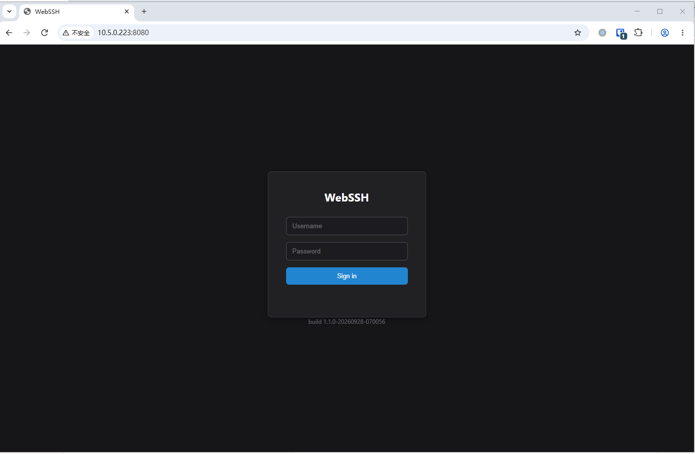
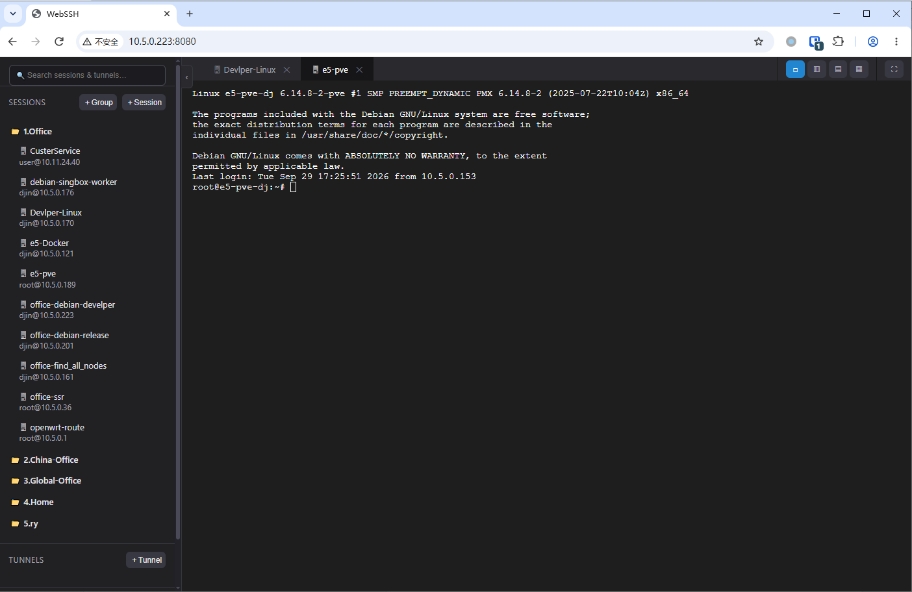

<div align="center">

# WebSSH

**A self-hosted, browser-based SSH client — Xshell-style, in a single Go binary.**
**自托管的浏览器 SSH 客户端 —— 类 Xshell 体验，单个 Go 二进制即可运行。**


**[English](#english) · [中文](#中文)**

</div>

---

<a id="english"></a>

# English

## Table of Contents

- [Screenshots](#screenshots)
- [Features](#features)
- [Quick Start](#quick-start)
- [Configuration](#configuration)
- [Project Structure](#project-structure)
- [REST API](#rest-api)
- [WebSocket Protocol](#websocket-protocol)
- [Versioning](#versioning)
- [Reverse Proxy Notes](#reverse-proxy-notes)
- [Security Notes](#security-notes)

## Screenshots

| Login | Workspace after login |
|:---:|:---:|
|  |  |

## Features

- **Real SSH, in the browser** — the Go backend dials genuine SSH connections (`golang.org/x/crypto/ssh`) and bridges an interactive PTY to the page over a WebSocket. The terminal is rendered by **xterm.js**.
- **Session manager** — a tree of saved sessions with groups, rename and move, plus search. Password and private-key (with passphrase) authentication.
- **Multi-tab & split panes** — run many terminals at once; layouts include single pane, left/right, top/bottom and a 4-pane grid, with full-screen and light/dark theme switching.
- **Persistent shells** — the remote shell keeps running for 30 minutes after the WebSocket drops. Reconnecting (e.g. after a page refresh or network blip) re-attaches to the *same* shell: same working directory, same running command, scrollback replayed.
- **Tunnel manager** — local (`-L`), remote (`-R`) and dynamic / SOCKS5 (`-D`) port forwarding, start/stop from the UI, optional auto-start.
- **SFTP file browser** — open it from any session (📁) in its own tab: browse, multi-file upload, download, rename, create folders, recursive delete. Uploads are **streamed** (no server-side buffering) with live progress, speed, ETA and a cancel button; partial files are cleaned up on failure.
- **SSH keepalive** — per-session `Keepalive interval` (default 30 s, `0` = off). Sends `keepalive@openssh.com` probes so NAT/firewalls don't drop idle links, and closes the connection after 3 missed probes so dead links are noticed instead of hanging. Applies to terminals, SFTP and tunnels.
- **Persistence** — sessions, groups and tunnels are saved to a JSON file under `DATA_DIR` (mount a volume in Docker).
- **Simple login** — single-user login guarding every API and WebSocket endpoint; credentials can be changed from the UI.
- **Tiny footprint** — static Go binary, Alpine-based image, runs as an unprivileged user.

## Quick Start

### Docker

```bash
docker build -t webssh .
docker run -d --name webssh \
  -p 8080:8080 \
  -e ADMIN_USER=admin \
  -e ADMIN_PASSWORD='change-me' \
  -v /data/webssh-data:/data \
  webssh
```

### Docker Compose

```bash
docker compose up -d --build
```

> Edit `ADMIN_PASSWORD` and the volume path in `docker-compose.yml` first.

Then open <http://localhost:8080> and sign in with `ADMIN_USER` / `ADMIN_PASSWORD`.

## Configuration

| Variable         | Default | Description |
|------------------|---------|-------------|
| `LISTEN_ADDR`    | `:8080` | HTTP listen address |
| `DATA_DIR`       | `/data` | Directory where `store.json` is persisted |
| `WEB_DIR`        | `./web` | Path to the static web client |
| `ADMIN_USER`     | `admin` | Bootstrap login username (used only until a password is set via UI/API) |
| `ADMIN_PASSWORD` | `admin` | Bootstrap login password — **set this in production** |

The admin username/password can also be changed after login (sidebar footer → 🔑, or `POST /api/admin/password`). Once changed, the new salted-hash credentials are stored in `store.json` and take precedence over the environment variables. Changing them signs out every active login, including your own. Logins are valid for 24 hours.

## Project Structure

```
.
├── main.go                  # Entry point
├── Dockerfile               # Multi-stage build (Go → Alpine)
├── docker-compose.yml
├── docker-entrypoint.sh     # Fixes /data ownership, then drops privileges
├── VERSION                  # Release number
├── internal/
│   ├── httpapi/             # REST handlers, WebSocket bridge, auth, SFTP endpoints
│   ├── model/               # Session / Group / Tunnel data models
│   ├── sshsvc/              # SSH client, keepalive, SFTP, tunnels, SOCKS5
│   └── store/               # JSON file persistence
└── web/                     # Static front-end (vanilla JS + xterm.js)
```

## REST API

All endpoints except `login`, `logout`, `me` and `version` require authentication.

| Area | Endpoint |
|------|----------|
| Auth | `POST /api/login` · `POST /api/logout` · `GET /api/me` |
| Version | `GET /api/version` → `{"version":"..."}` (unauthenticated) |
| Admin | `POST /api/admin/password` — `{"currentPassword","newUsername"?,"newPassword"}` |
| Groups | `GET/POST /api/groups` · `PUT/DELETE /api/groups/{id}` |
| Sessions | `GET/POST /api/sessions` · `GET/PUT/DELETE /api/sessions/{id}` |
| Tunnels | `GET/POST /api/tunnels` · `PUT/DELETE /api/tunnels/{id}` · `POST /api/tunnels/{id}/start` · `POST /api/tunnels/{id}/stop` |
| SFTP list | `GET /api/sftp/{sessionId}/list?path=` |
| SFTP mkdir | `POST /api/sftp/{sessionId}/mkdir` — `{"path"}` |
| SFTP rename | `POST /api/sftp/{sessionId}/rename` — `{"oldPath","newPath"}` |
| SFTP delete | `DELETE /api/sftp/{sessionId}/remove?path=` (recursive for directories) |
| SFTP upload | `POST /api/sftp/{sessionId}/upload?path=` — `multipart/form-data`, field `file` (repeatable) |
| SFTP download | `GET /api/sftp/{sessionId}/download?path=` |

Session JSON includes `keepAliveInterval` in seconds (omit on create → 30; `0` → disabled).

## WebSocket Protocol

`GET /ws/ssh?id={sessionId}&term={termId}&cols=&rows=`

`termId` identifies the **shell**, not the connection. Reuse the same `termId` across page refreshes to re-attach to the running shell; generate a new one for a genuinely new shell.

| Direction | Messages |
|-----------|----------|
| client → server | `{"type":"data","data":"..."}` · `{"type":"resize","cols":80,"rows":24}` · `{"type":"close"}` (kill the shell instead of just detaching) |
| server → client | `{"type":"data","data":"..."}` · `{"type":"error","message":"..."}` · `{"type":"closed"}` |

## Versioning

The version string is `<VERSION file>-<UTC build timestamp>`, e.g. `1.1.3-20261009-120000`, injected at build time via `-ldflags -X main.buildVersion=...`. Bump the release number by editing `VERSION` or passing `--build-arg APP_VERSION=x.y.z`; the timestamp changes on every build.

It is shown on the login screen and sidebar footer and is available at `GET /api/version` — handy for confirming that what you see is the build you just deployed, not a stale cache or an old container.

## Reverse Proxy Notes

- **Always terminate TLS** in front of WebSSH (Caddy / Nginx / Traefik) — credentials are POSTed to the login endpoint.
- Forward WebSocket upgrades for `/ws/`.
- For SFTP uploads behind Nginx, disable request buffering, otherwise the progress bar jumps straight to 100%:

```nginx
location / {
    proxy_pass http://127.0.0.1:8080;
    proxy_http_version 1.1;
    proxy_set_header Upgrade $http_upgrade;
    proxy_set_header Connection "upgrade";
    proxy_set_header Host $host;
    proxy_request_buffering off;
    client_max_body_size 0;
    proxy_read_timeout 3600s;
}
```

## Security Notes

> ⚠️ Read this before exposing WebSSH to the internet.

- **Host key verification is disabled** (`ssh.InsecureIgnoreHostKey()`). Switch to a `known_hosts`-based `HostKeyCallback` before using it beyond a trusted network.
- **Saved secrets are stored in plaintext** in `store.json`. Add at-rest encryption (e.g. AES-GCM with a key from an env var / KMS) if it will hold production credentials, and restrict access to `DATA_DIR`.
- **Single shared admin account** — suitable for personal or small-team use. Multi-user deployments need real user accounts.
- Change the default `admin` / `admin` credentials immediately and place the service behind TLS and, ideally, a VPN or IP allow-list.

---

<a id="中文"></a>

# 中文

## 目录

- [界面截图](#界面截图)
- [功能特性](#功能特性)
- [快速开始](#快速开始)
- [配置说明](#配置说明)
- [项目结构](#项目结构)
- [REST API](#rest-api-1)
- [WebSocket 协议](#websocket-协议)
- [版本号机制](#版本号机制)
- [反向代理注意事项](#反向代理注意事项)
- [安全提示](#安全提示)

## 界面截图

| 登录页 | 登录后的界面 |
|:---:|:---:|
|  |  |

## 功能特性

- **浏览器中的真实 SSH** —— Go 后端使用 `golang.org/x/crypto/ssh` 建立真实的 SSH 连接，并通过 WebSocket 把交互式 PTY 桥接到网页，终端由 **xterm.js** 渲染。
- **会话管理器** —— 树形结构管理已保存的会话，支持分组、重命名、移动与搜索；支持密码认证和私钥认证（含私钥口令）。
- **多标签 + 分屏** —— 同时打开多个终端；支持单窗格、左右分屏、上下分屏、四宫格布局，并支持全屏和明/暗主题切换。
- **终端会话保持** —— WebSocket 断开后，远端 Shell 仍会在后台保留 30 分钟。刷新页面或网络闪断后重新连接，会重新附着到**同一个** Shell：工作目录、正在执行的命令都不变，并回放历史输出。
- **隧道管理器** —— 支持本地转发（`-L`）、远程转发（`-R`）和动态 / SOCKS5 转发（`-D`），可在界面中启动/停止，并支持自动启动。
- **SFTP 文件浏览器** —— 在任意会话上点击 📁，即可在新标签页中浏览目录、多文件上传、下载、重命名、新建文件夹、递归删除。上传采用**流式传输**（服务器不做缓冲），实时显示进度、速度、剩余时间，并可取消；失败或取消时自动清理远端残留的半截文件。
- **SSH 保活（Keepalive）** —— 每个会话可单独设置 `Keepalive interval`（默认 30 秒，`0` 为关闭）。服务端定期发送 `keepalive@openssh.com` 探测包，防止 NAT / 防火墙回收空闲连接；连续 3 次无响应则关闭连接，让“假死”的链路及时暴露而不是一直卡住。对终端、SFTP 和隧道均生效。
- **数据持久化** —— 会话、分组、隧道配置保存在 `DATA_DIR` 下的 JSON 文件中（Docker 中请挂载数据卷）。
- **简易登录** —— 单用户登录保护所有 API 与 WebSocket，账号密码可在界面中修改。
- **轻量** —— 静态编译的 Go 程序，基于 Alpine 的镜像，以非特权用户运行。

## 快速开始

### Docker

```bash
docker build -t webssh .
docker run -d --name webssh \
  -p 8080:8080 \
  -e ADMIN_USER=admin \
  -e ADMIN_PASSWORD='change-me' \
  -v /data/webssh-data:/data \
  webssh
```

### Docker Compose

```bash
docker compose up -d --build
```

> 请先修改 `docker-compose.yml` 中的 `ADMIN_PASSWORD` 和数据卷路径。

然后访问 <http://localhost:8080>，使用 `ADMIN_USER` / `ADMIN_PASSWORD` 登录。

## 配置说明

| 环境变量         | 默认值   | 说明 |
|------------------|----------|------|
| `LISTEN_ADDR`    | `:8080`  | HTTP 监听地址 |
| `DATA_DIR`       | `/data`  | `store.json` 的持久化目录 |
| `WEB_DIR`        | `./web`  | 静态前端文件目录 |
| `ADMIN_USER`     | `admin`  | 初始登录用户名（仅在通过界面/API 设置密码之前生效） |
| `ADMIN_PASSWORD` | `admin`  | 初始登录密码 —— **生产环境务必修改** |

登录后也可修改管理员账号密码（侧边栏底部 → 🔑，或调用 `POST /api/admin/password`）。修改后，新的加盐哈希凭据会保存在 `store.json` 中，并优先于环境变量；修改会使所有已登录的会话失效（包括当前会话）。登录有效期为 24 小时。

## 项目结构

```
.
├── main.go                  # 程序入口
├── Dockerfile               # 多阶段构建（Go → Alpine）
├── docker-compose.yml
├── docker-entrypoint.sh     # 修正 /data 属主，然后降权运行
├── VERSION                  # 发布版本号
├── internal/
│   ├── httpapi/             # REST 处理、WebSocket 桥接、认证、SFTP 接口
│   ├── model/               # 会话 / 分组 / 隧道 数据模型
│   ├── sshsvc/              # SSH 客户端、保活、SFTP、隧道、SOCKS5
│   └── store/               # JSON 文件持久化
└── web/                     # 静态前端（原生 JS + xterm.js）
```

<a id="rest-api-1"></a>

## REST API

除 `login`、`logout`、`me`、`version` 外，所有接口都需要登录。

| 分类 | 接口 |
|------|------|
| 认证 | `POST /api/login` · `POST /api/logout` · `GET /api/me` |
| 版本 | `GET /api/version` → `{"version":"..."}`（无需登录） |
| 管理员 | `POST /api/admin/password` — `{"currentPassword","newUsername"?,"newPassword"}` |
| 分组 | `GET/POST /api/groups` · `PUT/DELETE /api/groups/{id}` |
| 会话 | `GET/POST /api/sessions` · `GET/PUT/DELETE /api/sessions/{id}` |
| 隧道 | `GET/POST /api/tunnels` · `PUT/DELETE /api/tunnels/{id}` · `POST /api/tunnels/{id}/start` · `POST /api/tunnels/{id}/stop` |
| SFTP 列目录 | `GET /api/sftp/{sessionId}/list?path=` |
| SFTP 新建目录 | `POST /api/sftp/{sessionId}/mkdir` — `{"path"}` |
| SFTP 重命名 | `POST /api/sftp/{sessionId}/rename` — `{"oldPath","newPath"}` |
| SFTP 删除 | `DELETE /api/sftp/{sessionId}/remove?path=`（目录递归删除） |
| SFTP 上传 | `POST /api/sftp/{sessionId}/upload?path=` — `multipart/form-data`，字段名 `file`（可重复） |
| SFTP 下载 | `GET /api/sftp/{sessionId}/download?path=` |

会话 JSON 中包含 `keepAliveInterval`（单位：秒；创建时省略则为 30，`0` 表示关闭）。

## WebSocket 协议

`GET /ws/ssh?id={sessionId}&term={termId}&cols=&rows=`

`termId` 标识的是 **Shell**，而不是连接。刷新页面时复用同一个 `termId` 即可重新附着到正在运行的 Shell；需要全新 Shell 时请生成新的 `termId`。

| 方向 | 消息 |
|------|------|
| 客户端 → 服务端 | `{"type":"data","data":"..."}` · `{"type":"resize","cols":80,"rows":24}` · `{"type":"close"}`（彻底结束 Shell，而不是仅断开） |
| 服务端 → 客户端 | `{"type":"data","data":"..."}` · `{"type":"error","message":"..."}` · `{"type":"closed"}` |

## 版本号机制

版本号格式为 `<VERSION 文件内容>-<UTC 构建时间戳>`，例如 `1.1.3-20261009-120000`，在构建时通过 `-ldflags -X main.buildVersion=...` 注入。要升级版本号，修改 `VERSION` 文件或传入 `--build-arg APP_VERSION=x.y.z` 即可；时间戳部分每次构建都会变化。

版本号会显示在登录页和侧边栏底部，也可通过 `GET /api/version` 获取 —— 用来确认你看到的是刚部署的版本，而不是浏览器缓存或仍在运行的旧容器。

## 反向代理注意事项

- **务必在前端配置 TLS**（Caddy / Nginx / Traefik），因为登录凭据是通过 POST 提交的。
- 需要为 `/ws/` 转发 WebSocket 升级请求。
- 在 Nginx 后使用 SFTP 上传时，请关闭请求缓冲，否则进度条会瞬间跳到 100%：

```nginx
location / {
    proxy_pass http://127.0.0.1:8080;
    proxy_http_version 1.1;
    proxy_set_header Upgrade $http_upgrade;
    proxy_set_header Connection "upgrade";
    proxy_set_header Host $host;
    proxy_request_buffering off;
    client_max_body_size 0;
    proxy_read_timeout 3600s;
}
```

## 安全提示

> ⚠️ 将 WebSSH 暴露到公网之前，请务必阅读本节。

- **未校验主机密钥**（使用了 `ssh.InsecureIgnoreHostKey()`）。在非可信网络中使用前，请改为基于 `known_hosts` 的 `HostKeyCallback`。
- **已保存的密码/私钥以明文存储**在 `store.json` 中。如果要保存生产环境凭据，请增加静态加密（例如使用来自环境变量或 KMS 的密钥做 AES-GCM），并限制对 `DATA_DIR` 的访问权限。
- **仅有一个共享的管理员账号**，适合个人或小团队使用；多用户场景需要实现真正的用户体系。
- 请立即修改默认的 `admin` / `admin` 账号密码，并将服务置于 TLS 之后，最好再配合 VPN 或 IP 白名单。

---

## Acknowledgements / 致谢

- [xterm.js](https://github.com/xtermjs/xterm.js) (MIT) — terminal rendering / 终端渲染
- [gorilla/websocket](https://github.com/gorilla/websocket) · [pkg/sftp](https://github.com/pkg/sftp) · [golang.org/x/crypto](https://pkg.go.dev/golang.org/x/crypto)

## License / 许可证

Released under the [MIT License](LICENSE).
本项目基于 [MIT 许可证](LICENSE) 开源。
